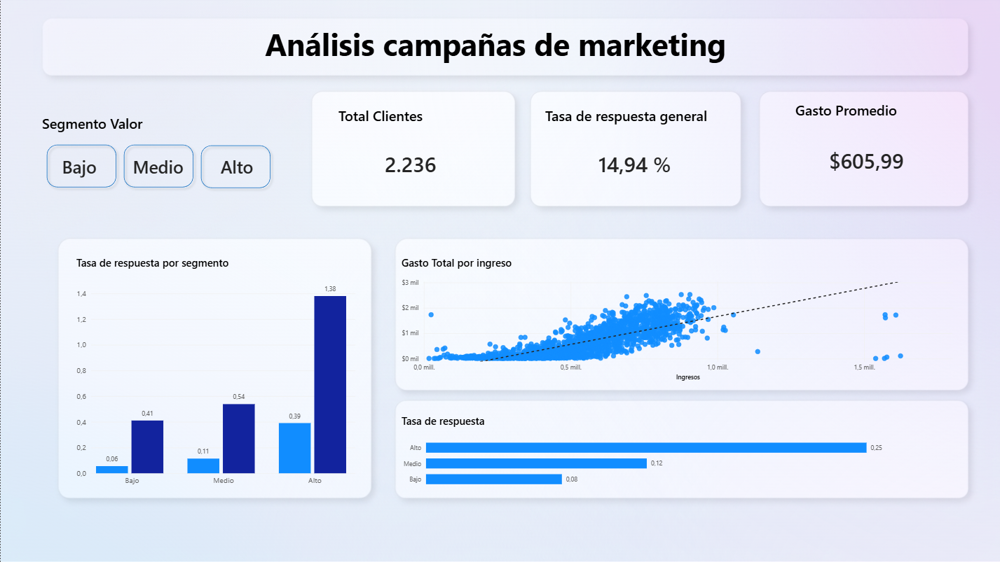

# Customer & Campaign Intelligence

Análisis de segmentación de clientes y respuesta a campañas de marketing para identificar los segmentos con mayor potencial de respuesta y establecer prioridades para futuras estrategias comerciales.

## Problema de negocio

Una empresa de retail cuenta con información histórica de sus clientes, comportamiento de compra y respuesta a campañas de marketing.

El objetivo del análisis es responder preguntas como:

- ¿Qué segmentos de clientes presentan mayor tasa de respuesta?
- ¿Existe una relación entre el valor del cliente y su respuesta a campañas?
- ¿Qué características diferencian a los clientes con mayor respuesta?
- ¿Qué segmentos deberían priorizarse en futuras campañas?
- ¿Qué canales o comportamientos presentan patrones relevantes?

A partir de estas preguntas se construyó un flujo completo de **Data Analytics orientado a negocio**, desde la auditoría y preparación de los datos hasta la segmentación, análisis de resultados y visualización en Power BI.

---

## Objetivos

- Auditar la calidad y consistencia de los datos.
- Limpiar y preparar el dataset para el análisis.
- Crear variables relevantes para caracterizar a los clientes.
- Analizar el comportamiento de compra y respuesta a campañas.
- Segmentar clientes según características de valor y comportamiento.
- Identificar patrones asociados con una mayor tasa de respuesta.
- Traducir los hallazgos en recomendaciones comerciales.
- Construir un dashboard en Power BI para facilitar la interpretación de los resultados.

---

## Flujo del proyecto

```text
Datos
  │
  ▼
Auditoría de datos
  │
  ▼
Limpieza y transformación
  │
  ▼
Feature Engineering
  │
  ▼
Análisis exploratorio
  │
  ▼
Segmentación de clientes
  │
  ▼
Análisis de respuesta
  │
  ▼
Insights de negocio
  │
  ▼
Recomendaciones
  │
  ▼
Power BI Dashboard
```

---

## Dataset

El proyecto utiliza el dataset público **Marketing Campaign**, basado en:

> Parr-Rud, O. (2014). *Business Analytics Using SAS Enterprise Guide and SAS Enterprise Miner*. SAS Institute.

El dataset contiene información demográfica, comportamiento de compra y respuesta histórica de clientes frente a diferentes campañas de marketing.

Los datos se utilizan como base para desarrollar el análisis y demostrar un flujo de trabajo completo de **Data Analytics orientado a negocio**.

---

## Tecnologías utilizadas

- **Python**
  - Pandas
  - NumPy
  - Matplotlib
  - Seaborn
- **Jupyter Notebook**
- **Power BI**
- **Git / GitHub**

---

## Estructura del repositorio

```text
Customer-Campaign-Intelligence/
│
├── assets/
│   └── Dashboard.png
│
├── data/
│   ├── raw/
│   │   └── marketing_campaign.csv
│   │
│   └── processed/
│       ├── marketing_campaign_clean.csv
│       └── marketing_campaign_features.csv
│
├── notebooks/
│   ├── 01_data_audit.ipynb
│   ├── 02_data_cleaning.ipynb
│   ├── 03_feature_engineering.ipynb
│   └── 04_analysis.ipynb
│
├── script/
│   └── pipeline.py
│
├── dashboard/
│   └── [Power BI Dashboard]
│
└── README.md
```

---

# Metodología

## 1. Data Audit

El primer paso consistió en realizar una auditoría inicial del dataset para conocer su estructura y detectar problemas de calidad.

Se revisaron:

- Dimensiones del dataset.
- Tipos de datos.
- Valores nulos.
- Registros duplicados.
- Categorías inconsistentes.
- Valores atípicos.
- Variables numéricas y categóricas.
- Rangos y distribuciones.
- Consistencia de las variables utilizadas posteriormente en el análisis.

El dataset original se mantuvo sin modificaciones dentro de `data/raw/`.

---

## 2. Data Cleaning

Después de identificar los problemas de calidad se realizó el proceso de limpieza.

Entre las principales transformaciones se encuentran:

- Tratamiento de valores faltantes.
- Imputación mediante mediana cuando fue apropiado.
- Revisión y tratamiento de valores atípicos utilizando IQR y contexto de negocio.
- Corrección de tipos de datos.
- Normalización de categorías.
- Tratamiento de registros inconsistentes.
- Generación del dataset limpio.

El resultado se almacena en:

```text
data/processed/marketing_campaign_clean.csv
```

---

## 3. Feature Engineering

Se crearon variables derivadas para facilitar la caracterización y segmentación de los clientes.

Entre las principales variables utilizadas se encuentran:

| Variable | Descripción |
|---|---|
| `Edad` | Edad del cliente |
| `Gasto_Total` | Gasto acumulado del cliente |
| `Compras_Totales` | Número total de compras |
| `Campañas_Aceptadas` | Número de campañas aceptadas históricamente |
| `Dependientes` | Número de personas dependientes |
| `Antiguedad_Cliente` | Antigüedad del cliente |

Estas variables permiten analizar al cliente desde diferentes perspectivas:

- Valor económico.
- Comportamiento de compra.
- Historial de respuesta.
- Características demográficas.
- Antigüedad.

El dataset resultante se almacena en:

```text
data/processed/marketing_campaign_features.csv
```

---

# Análisis

El análisis se enfocó principalmente en la relación entre el comportamiento histórico del cliente, su valor y la respuesta a campañas.

Se analizaron:

- Tasa de respuesta general.
- Tasa de respuesta por segmento.
- Valor económico de los clientes.
- Historial de aceptación de campañas.
- Relación entre ingresos y gasto.
- Comportamiento de compra.
- Uso de diferentes canales.
- Diferencias entre segmentos de clientes.

---

# Principales Insights

## 1. Los clientes de mayor valor presentan una mayor tasa de respuesta

Los clientes clasificados como de alto valor presentan una tasa de respuesta aproximada del **24,6%**, frente al **7,6%** observado en los clientes de bajo valor.

Esto representa una diferencia de aproximadamente **3,2 veces**.

**Implicación de negocio:** los clientes de mayor valor representan un segmento prioritario para estrategias de retención y campañas personalizadas.

---

## 2. El historial de respuesta muestra un patrón consistente

Los clientes que habían aceptado campañas anteriormente presentan tasas de respuesta considerablemente superiores a las de clientes sin historial de aceptación.

Dependiendo del segmento de valor analizado, la diferencia se encuentra aproximadamente entre **3,5 y 7,3 veces**.

Esto indica que el comportamiento histórico frente a campañas puede ser una señal relevante para establecer prioridades de contacto.

**Implicación de negocio:** las campañas futuras pueden priorizar clientes con historial positivo de respuesta, especialmente cuando además presentan un alto valor comercial.

---

## 3. El catálogo presenta una diferenciación importante entre segmentos

El uso del canal de catálogo presenta una diferencia considerable entre clientes de alto y bajo valor, llegando a ser aproximadamente **19 veces mayor en el segmento de alto valor**.

La diferencia observada es mayor que la encontrada en otros canales analizados.

**Implicación de negocio:** el catálogo puede evaluarse como un canal potencialmente relevante para estrategias dirigidas a clientes de alto valor.

---

# Recomendaciones de negocio

### 1. Priorizar clientes con historial positivo

Dar mayor prioridad a clientes que anteriormente hayan respondido favorablemente a campañas.

Esto permite concentrar esfuerzos comerciales sobre clientes que ya han demostrado interacción con este tipo de estrategia.

### 2. Diseñar estrategias diferenciadas para clientes de alto valor

Los clientes de alto valor presentan una tasa de respuesta superior, por lo que pueden beneficiarse de campañas más segmentadas y personalizadas.

Dentro de este grupo también resulta relevante trabajar con los clientes de alto valor que todavía no presentan historial de respuesta.

### 3. Evaluar el catálogo como canal para clientes de alto valor

La fuerte diferencia observada en el uso del catálogo entre segmentos justifica analizar este canal de manera específica en futuras campañas dirigidas a clientes de mayor valor.

### 4. Utilizar el comportamiento histórico para priorización

El historial de aceptación de campañas puede incorporarse como criterio de segmentación para definir diferentes niveles de prioridad comercial.

---

# Dashboard

El análisis fue llevado a **Power BI** para construir una vista ejecutiva que permita explorar los principales indicadores y segmentos identificados.



El dashboard permite analizar, entre otros:

- Total de clientes.
- Tasa de respuesta.
- Gasto promedio.
- Tasa de respuesta por segmento de valor.
- Relación entre ingresos y gasto total.
- Comparación entre segmentos.
- Comportamiento histórico frente a campañas.
- Diferencias relevantes entre grupos de clientes.

---

# Reproducibilidad

El proyecto incluye un pipeline en Python que permite reproducir las principales etapas de preparación de los datos.

Desde la carpeta `script`:

```bash
cd script
python pipeline.py
```

El pipeline realiza las transformaciones necesarias para generar los archivos procesados utilizados posteriormente en el análisis.

También es posible ejecutar los notebooks en orden:

```text
01_data_audit.ipynb
        ↓
02_data_cleaning.ipynb
        ↓
03_feature_engineering.ipynb
        ↓
04_analysis.ipynb
```

---

# Resultados

El proyecto demuestra un flujo completo de trabajo de **Data Analytics**:

- Exploración y auditoría de datos.
- Data Cleaning.
- Feature Engineering.
- Análisis exploratorio.
- Segmentación.
- Análisis de comportamiento.
- Identificación de patrones.
- Generación de insights.
- Recomendaciones orientadas a negocio.
- Visualización mediante Power BI.
- Automatización de la preparación de datos mediante Python.

El objetivo es transformar datos de clientes y campañas en información útil para apoyar la **toma de decisiones comerciales**.

---

# Autor

## David Fernando Solano Garcia

**Analista de Datos · Excel avanzado, Python, SQL & Power BI**

Transformo datos operativos y comerciales en decisiones de negocio.

- **GitHub:** DSGProjects
- **LinkedIn:** David Fernando Solano Garcia